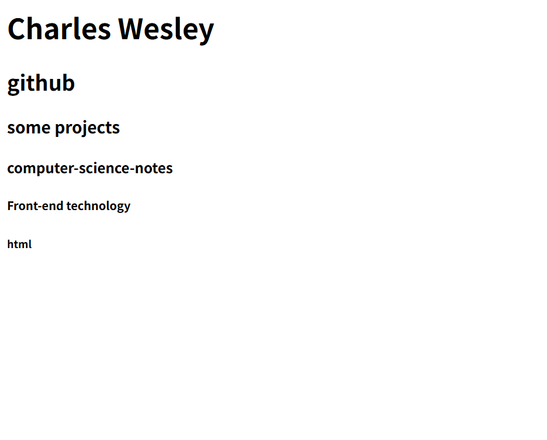
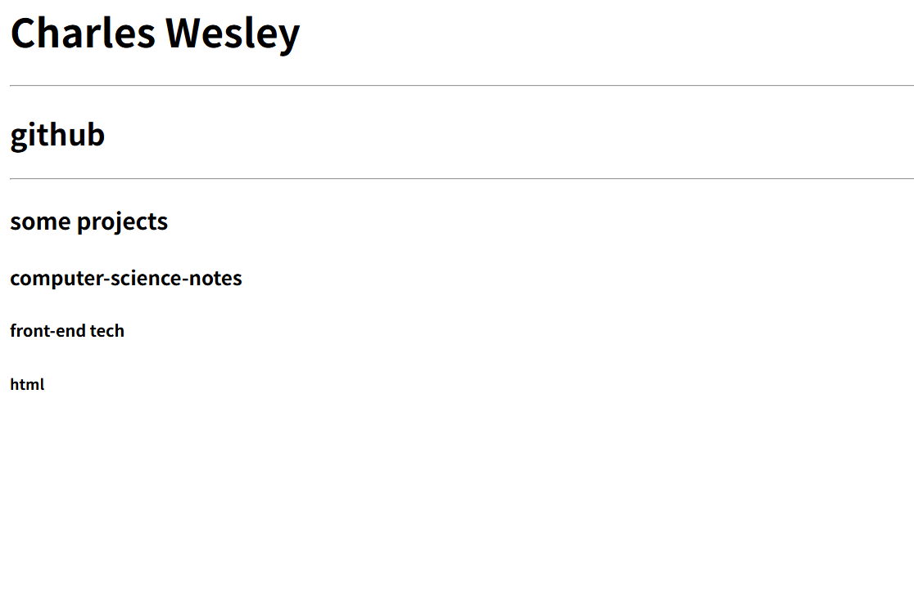

# HTML1: Understanding Webpages with HTML

## 1.1 Introduction to HTML
HTML is a markup language used to create and design web pages and their content. It uses tags and labels to define the structure and elements of a webpage, such as headings, paragraphs, links, and images. HTML files are typically saved with the `.html` extension and rendered by browsers, presenting them to users as the webpages we see today. HTML often contains elements like `<h1>`, which we call tags. It's important to note that tags often appear in pairs, for example, `<h1> `  ` </h1>`

## 1.2 HTML Basics 1
### 1.2.1 Titles, Headings, and Basic Formatting
#### 1.2.1.1 Titles and Basic Formatting
The English word for title is `head`, so its tag is `<h>`. `<h1>-<h6>` represent the hierarchy of titles, with `<h1>` being the largest title and `<h6>` being the smallest. However, when writing code, it's quite different from the Python documentation I updated earlier. Let's take a look at an example.

It's important to note that HTML code runs very differently from Python, Java, and C. Python, Java, and C are backend languages, while HTML is frontend, meaning the web page you see. Therefore, VSCode can't parse this code like a browser, so running it is very different from Python. The steps for running it are: 1. Save your code; 2. Find the file corresponding to the code; 3. Open it in a browser.
```html
<html>

    <body>
        <h1>Charles Wesley</h1>
        <h2>github</h2>
        <h3>some projects</h3>
        <h4>computer-science-notes</h4>
        <h5>Front-end technology</h5>
        <h6>html</h6>
        
    </body>

</html>
```
First, you need to write `<html>`, which indicates that the code is in HTML. Remember to include the `</html>` (this will appear automatically in VS Code).
Here, `h1`, `h2`, and so on, all need to appear in pairs.



This is the distribution of title sizes.

The HTML above generally appears in pairs. While most HTML appears in pairs, there are exceptions. For example, the `<hr>` below adds a dividing line.
```html
<html>
    <body>
        <h1>Charles Wesley</h1>
        <hr>
        <h2>github</h2>
        <hr>
        <h3>some projects </h3>
        <h4>computer-science-notes</h4>
        <h5>front-end tech</h5>
        <h6>html</h6>
        
    </body>

</html>
```


#### 1.2.1.2 Header
The header refers to the name of the tab opened, such as the following  How do we implement this on a web page? Use `<title></title>`, which is the header, and they need to appear in pairs.
```html
<html>
    <head>
        <title>Charles Wesley</title>
    </head>

    <body>
        <h1>Charles Wesley</h1>
        <hr>
        <h2>github</h2>
        <hr>
        <h3>some projects</h3>
        <h4>computer-science-notes</h4>
        <h5>front-end tech</h5>
        <h6>html</h6>
        
    </body>

</html>
```
The head here has been changed to Charles Wesley.

### 1.2.2 Paragraphs
The English word for paragraph is "paragraph," so in HTML the tag is <p>. Be careful not to forget its "brother" </p> (needs bidirectionality).
```html
<html>
    <body>
        <h1>Charles Wesley</h1>
        <p>github，CSDN，知乎等等都有文章更新</p>
        <hr>
        <h2>github</h2>
        <hr>
        <h3>some projects</h3>
        <h4>computer-science-notes</h4>
        <h5>front-end tech</h5>
        <h6>html</h6>
        
    </body>

</html>
```


Below the main title, I added a line about myself.

If you need to wrap a paragraph and don't want each line to be too long and unsightly, you can use `<br>` to separate the paragraphs. Like `<hr>`, `<br>` is a bit different; it appears independently.
```html
<html>
    <head>
        <title>Charles Wesley</title>
    </head>

    <body>
        <title>Charles Wesley</title>
        <h1>Charles Wesley</h1>
        <p>update blog on<br>CSDN<br>github</p>
        <hr>
        <h2>github</h2>
        <hr>
        <h3>some projects</h3>
        <h4>computer-science-notes</h4>
        <h5>front-end tech</h5>
        <h6>html</h6>
        
    </body>

</html>
```
 CSDN and GitHub have wrapped lines, this is the purpose of `<br>`.

