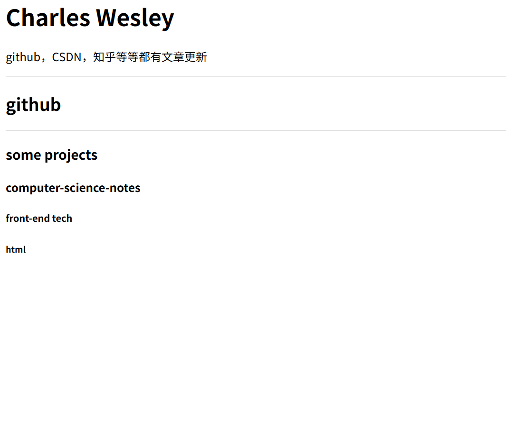
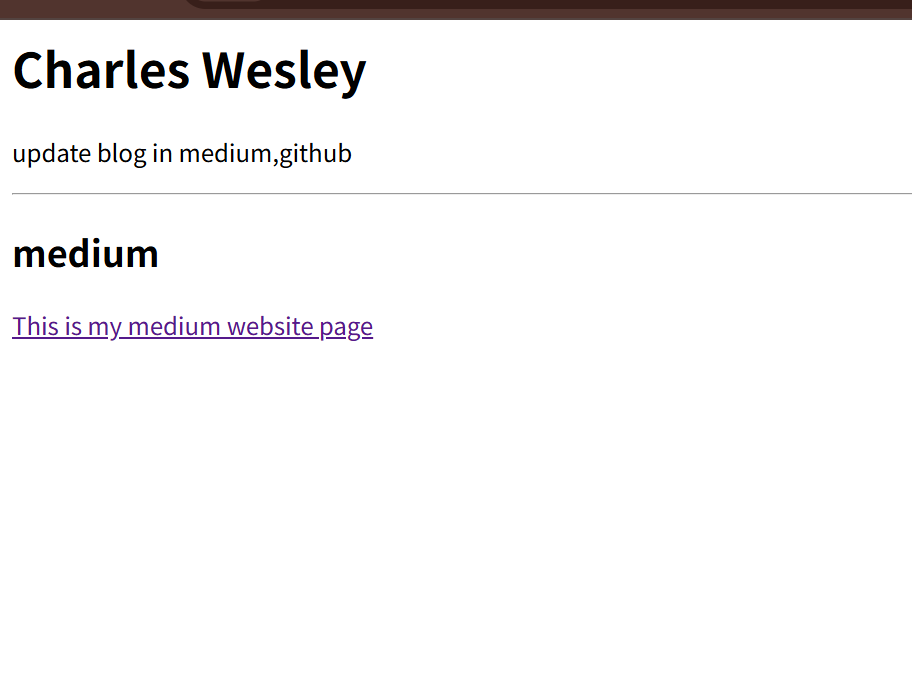

# HTML2: Hyperlinks and Images

## 2.1 HTML Hyperlinks

On a Medium page, clicking on a title will redirect you to the article (that is, a different page). Essentially, HTML code is a hyperlink.
```html
<a href="https://medium.com/@wesley123aj">This is my medium website page</a>
```

This is how to use hyperlinks in HTML. In `<a href="https://medium.com/@wesley123aj">`, the webpage you want to jump to is embedded. In the back, `This is my medium website</a>` is the text displayed on the webpage. Clicking this text can go to other places.

```html
<html>
    <head>
        <title>Charles Wesley</title>
    </head>

    <body>
        <title>Charles Wesley</title>
        <h1>Charles Wesley</h1>
        <p>update blog in medium,github</p>
        <hr>
        <h2>medium</h2>
        <a href="https://medium.com/@wesley123aj">This is my medium website page</a>
        
    </body>

</html>
```


On this web page, there is a blue link. You can jump by clicking the link.

### 2.1.1 Target Properties
In the above example, if you click on a link, you will be redirected to the same page.Jump to the same page. If you want to jump to different pages and want to view two pages at the same time, you need to add the `target` tag.

```html
<html>
    <head>
        <title>Charles Wesley</title>
    </head>

    <body>
        <title>Charles Wesley</title>
        <h1>Charles Wesley</h1>
        <p>在<br>知乎,github更新博客</p>
        <hr>
        <h2>知乎</h2>
        <a href="https://medium.com/@wesley123aj">This is my medium website page</a>
        
    </body>

</html>
```

