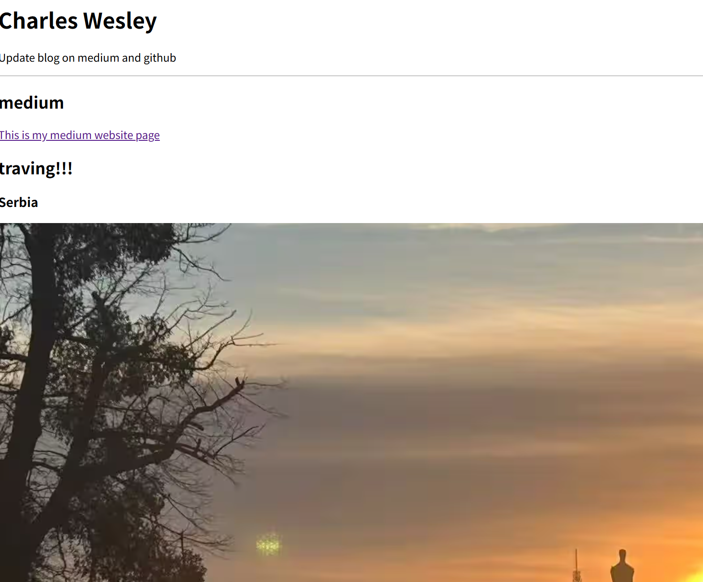
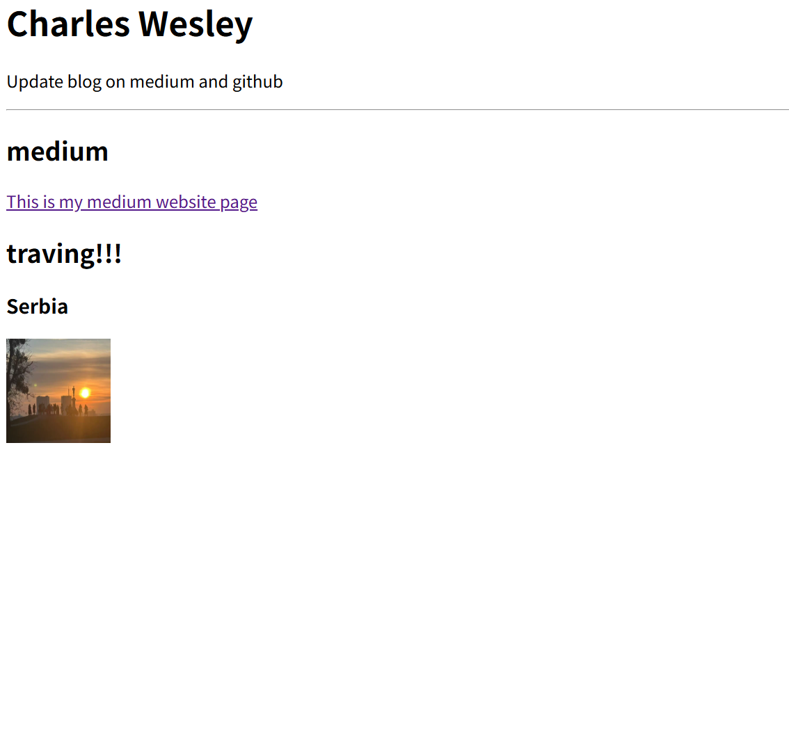
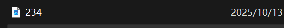
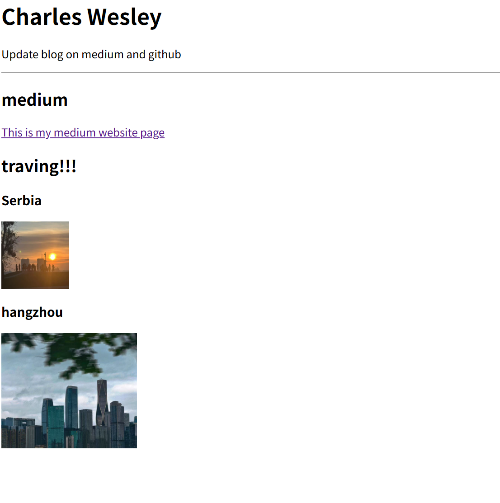

# HTML2: Hyperlinks and Images

## 2.1 HTML Hyperlinks

On a Medium page, clicking on a title will redirect you to the article (that is, a different page). Essentially, HTML code is a hyperlink.
```html
<a href="https://medium.com/@wesley123aj">This is my medium website page</a>
```

This is how to use hyperlinks in HTML. In `<a href="https://medium.com/@wesley123aj">`, the webpage you want to jump to is embedded. In the back, `This is my medium website</a>` is the text displayed on the webpage. Clicking this text can go to other places.

```html
<html>
    <head>
        <title>Charles Wesley</title>
    </head>

    <body>
        <title>Charles Wesley</title>
        <h1>Charles Wesley</h1>
        <p>update blog in medium,github</p>
        <hr>
        <h2>medium</h2>
        <a href="https://medium.com/@wesley123aj">This is my medium website page</a>
        
    </body>

</html>
```


On this web page, there is a blue link. You can jump by clicking the link.

### 2.1.1 Target Properties
In the above example, if you click on a link, you will be redirected to the same page.Jump to the same page. If you want to jump to different pages and want to view two pages at the same time, you need to add the `target` tag.

```html
<html>
    <head>
        <title>Charles Wesley</title>
    </head>

    <body>
        <title>Charles Wesley</title>
        <h1>Charles Wesley</h1>
        <p>Update blog on medium and github</p>
        <hr>
        <h2>medium</h2>
        <a href="https://medium.com/@wesley123aj" target = "_blank" >This is my medium website page</a>
        
    </body>

</html>
```

Here `target = "_blank" ` means opening another web page.


## 2.2 Images
Images are an indispensable and crucial element in a webpage. So, how do you embed photos when creating a webpage?
```html

```

Here is the definition of using photo in html
```html

```

```html
<html>
    <head>
        <title>Charles Wesley</title>
    </head>

    <body>
        <title>Charles Wesley</title>
        <h1>Charles Wesley</h1>
        <p>Update blog on medium and github</p>
        <hr>
        <h2>medium</h2>
        <a href="https://medium.com/@wesley123aj" target = "_blank" >This is my medium website page</a>
        <h2>traving!!!</h2>
        <h3>Serbia</h3>
        
    </body>

</html>
```



This photo is really too big, so we need to define the height and width.

```html
<html>
    <head>
        <title>Charles Wesley</title>
    </head>

    <body>
        <title>Charles Wesley</title>
        <h1>Charles Wesley</h1>
        <p>Update blog on medium and github</p>
        <hr>
        <h2>medium</h2>
        <a href="https://medium.com/@wesley123aj" target = "_blank" >This is my medium website page</a>
        <h2>traving!!!</h2>
        <h3>Serbia</h3>
        
    </body>

</html>
```



This is how you resize the photo. You can also adjust the width and height parameters to enlarge or reduce the image.

In HTML code, images require loading time, so if there are too many photos, it may take some time to load.

This isn't just a link. If the photos are in the same folder (on your local computer), you can use the file command to access them.



I put the photo called 234.jpg into a folder (it must be the same folder)
```html
<html>
    <head>
        <title>Charles Wesley</title>
    </head>

    <body>
        <title>Charles Wesley</title>
        <h1>Charles Wesley</h1>
        <p>Update blog on medium and github</p>
        <hr>
        <h2>medium</h2>
        <a href="https://medium.com/@wesley123aj" target = "_blank" >This is my medium website page</a>
        <h2>traving!!!</h2>
        <h3>Serbia</h3>
        
        <h3>hangzhou</h3>
        
    </body>

</html>
```

When you open the website, you will see the photo 234.jpg.

