# Hardware 1: Logic Gates

Logic gates are fundamental to computers, used to implement programming functions like "if" and "while" operations. They are an essential component of computers.

## 1.1 Logic Gate (Logic Gate with a Single Input)
### 1.1.1 YES Gate
The YES gate represents a positive affirmation. Therefore, if the input is 1, the output is 1; if the input is 0, the output is 0.
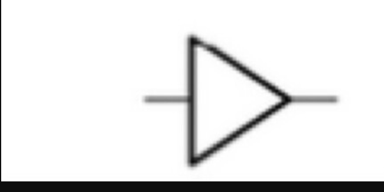

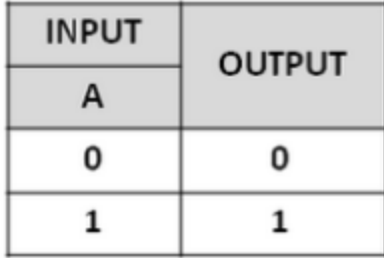

The 1 and 0 can be imagined as a high voltage and a low voltage, with 1 being a high voltage and 0 being a low voltage.

A high voltage input results in a high voltage output, while a low voltage input results in a low voltage output. Similarly, a low voltage input results in a low voltage output.

### 1.1.2 NOT Gate
The second logic gate is the NOT gate. You can see here that the NOT gate differs from the NOT gate in that it has a bead, which represents the opposite. As long as this bead is present, the function is the opposite.
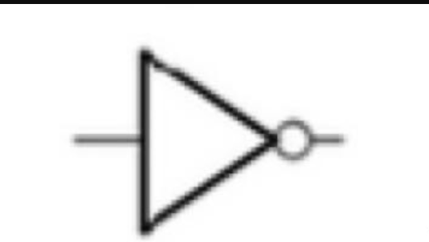

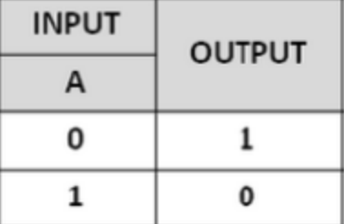

But there's a counterintuitive point here: when I put low voltage in, why does a high voltage come out? There must be something going on here. This is the function of transistors, and transistor circuits make this possible.

## 2.2 Two-Input Logic Gate
Among these two-input logic gates, let's first introduce the AND gate.
### 2.2.1 AND Gate
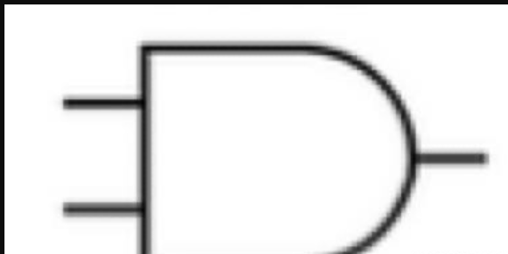

Here we have two input channels. Again, let's look at the truth table. Notice that in this diagram, the left side is the input, labeled Input A and Input B, and the output is represented by Y.
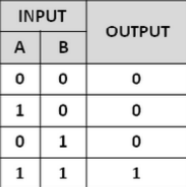

What does "AND" mean? Both conditions A and B must be met for the output to be high. Otherwise, no output is generated. This is the logic gate that implements the "AND" condition in an if statement.
### 2.2.2 OR Gate
What does "or" mean? "or" means either A or B. If either condition A or B is met, it's ok. But neither condition can be met. So the truth table is
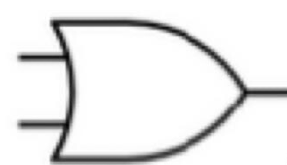

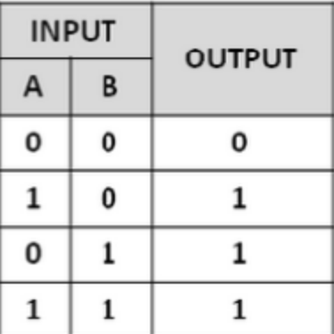

In this truth table, as long as one input is high, the output is guaranteed to be high.
### 2.2.3 XOR Gate
Exclusive OR is a less common term in everyday life, while AND and OR are more common. XOR means that if both inputs are the same, the output is 1; if both inputs are the same, the output is 0.
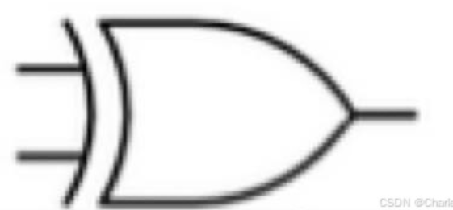

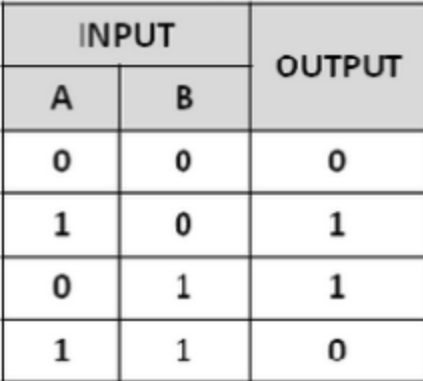

### 2.2.4 NAND (NAND Gate)
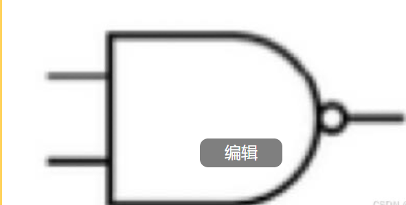

The name NAND gate means it is a combination of an AND gate and a NOT gate (a combination of a NOT gate and an AND gate). There is a bead in front of it, so just remember the AND gate. This gate is just a reverse operation.

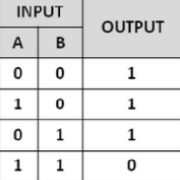

This result is completely opposite to the AND gate, so we'll use this idea to draw the NAND gate.

### 2.4.5 NOR (NOR Gate)
The NOR gate and the NAND gate have the same meaning, and the NOR gate's truth table is completely opposite to the OR gate's. Therefore, the structure is the same as above, except that the AND gate is replaced by an OR gate. Again, there's a bead in front. Essentially, just remember to swap the positive and negative outputs.
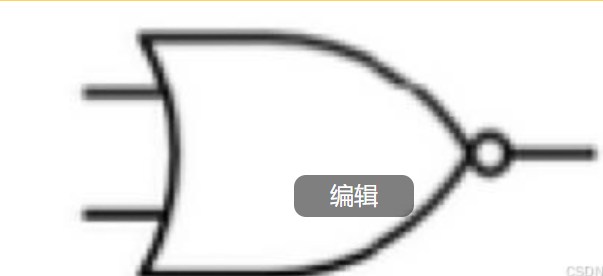

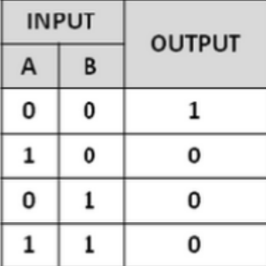

The exact opposite of the AND gate, so the NOR gate should have the same structure as above. The NOR gate is a combination of an OR gate and a NAND gate.

### 2.4.6 XNOR gate
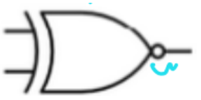
This is the XNOR gate, which is essentially the opposite of the XOR gate. Once you understand the XOR gate, you can just do it the opposite way.
