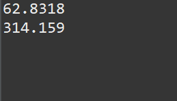
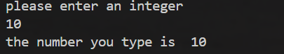
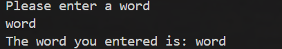
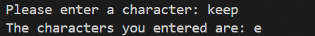

# Java: 1 Basics

## 1.1 Variables
Imagine a computer's memory as a hotel with many rooms. Each room has a number (similar to a variable's address), and each room can only accommodate a specific type of guest (similar to a variable's data type).
Variable name = room number (101, 202, 201, 302, etc.)
Variable type = room type (single, double, couple's suite, deluxe presidential suite, etc.)
Variable value = guest (the guest must fit the room type. For example, five people can't sleep in a single room. For example, a couple can sleep in a standard double room, but they'd definitely prefer a couple's suite.)

```Java
public class PRICE {
	public static void main(String[] args) {
		// TODO Auto-generated method stub
		int price = 15;
		int num = 20;
		int allprice = price * num;
		System.out.println("total price is " + allprice);
	}
}
```
You don't need to understand the meaning of this code here. price is a variable, which can be understood as a room number, and the room type is int and the number of guests is 15. Similarly, num is a variable, also of type int, and the number of guests (value) is 20. allprice is also a variable, but its value needs to be obtained by multiplying price by num.

```java
public class Price {

	public static void main(String[] args) {
		// TODO Auto-generated method stub
		double price = 10.0;
		int number = 30;
		double total = price * number;
		System.out.println("The final total price is  "+ total );
	}
}
```
There are three variables here: price, a double variable with a value of 10.0; number, an int variable with a value of 30; and total, a double variable, which needs to be calculated using price * number.

## 1.1. Output

Then there's System.out.println(). The System (system), out (output), and print (print) functions essentially mean system output. The ln (line feed) stands for line break, meaning the next item is printed on the next line.
So, in Java, we typically use System.out.println() for output.

```java
System.out.printf("circumference is %.2f, ", zhouchang);
```

This sentence is different from the previous one. The use of `printf` (print: print; f: format: format) at the end indicates that the final output must follow a certain format, and we can set the format. So `zhouchang is %.2f,` means my format is my output. So what does `%.2f` mean? It means that the data output in this place must have two decimal places. The following `zhouchang` is passed to %.2f and then output with two decimal places.
```java
public class Price {

	public static void main(String[] args) {
		// TODO Auto-generated method stub
		final double PI = 3.14159;
		int r = 10;
		double zhouzhang = 2*PI*r;
		double square = PI *r*r;
		System.out.printf("circumference is %.2f, ", zhouzhang);
		System.out.println(square);
		
	}

}
```
The output is


Because the first statement doesn't use println, the second one doesn't wrap, resulting in this.

## 1.2. Variable Names
Let's explain each one one by one. First, what are the special requirements for variable names?
1. Letters, Numbers, and Underscores: Variable names can consist of letters (A-Z, a-z), numbers (0-9), and underscores (_), but must begin with a letter or underscore. For example, age, _count, and userName1 are all legal variable names, while 1user and @name are not.
2. Case Sensitivity: Java is case-sensitive, so age and Age are two different variable names.
3. No Keywords: Java keywords (such as int, class, and public) cannot be used in variable names, as these keywords have special meanings.
4. Naming Conventions: To improve code readability, camelCase is generally used, meaning the first word in a variable name is lowercase, and the first letter of subsequent words is capitalized. For example, firstName, totalAmount, totalStudentNumber.

## 1.3. Variable Types
The variable types frequently mentioned in 1 (the room types mentioned earlier), such as int and double, are now listed here.

int: Integer
double: Floating-point number (decimal)
String: String
char: A single letter (for example, 'A')
final: Constant (variable name followed by all capital letters) and cannot be changed. If changed, an error will be reported (it is not a variable type and must be followed by another).

```java
public class practice2 {
	public static void main(String[] args) {
		// TODO Auto-generated method stub
		int r = 10;
		final double PI = 3.14;//The variable name that follows is capitalized and cannot be modified
		double zhouchang = 2* PI * r;
		double mianji = PI * r*r;
		System.out.println(zhouchang);
		System.out.println(mianji);
	}
}

```
Since int is an integer, the values ​​that follow it can only be integers. And finally isn't a variable type. We need to add a double data type after it. Since PI is always a double, the data type of zhouchang (two integers multiplied by a decimal) must be a decimal, so we use the double data type.

```java
public class Price {

	public static void main(String[] args) {
		// TODO Auto-generated method stub
		final double PI = 3.14159;
		int r = 10;
		double zhouzhang = 2*PI*r;
		double square = PI *r*r;
		System.out.println(zhouzhang);
		System.out.println(square);
		
	}

}
```


This is the output of the code above.
## 1.4 Arithmetic Operators
### 1.4.1 General Arithmetic Operators

Addition: +
Subtraction: -
Multiplication: *
Division: /. This division operation returns the value after the division, regardless of the value following it.
Mod: %, this operation returns the remainder.

### 1.4.2 Special arithmetic operators (++, --)
```java
public class c3 {
	public static void main(String[] args) {
		// TODO Auto-generated method stub
		int num =2;
		System.out.println(num++);//The answer is 2 because it is taken out first and then calculated.
		int num = 5;
        int result1 = num++;  // Post-increment: assign the value first, then num becomes 6
        int result2 = ++num;  // Pre-increment: num is first changed to 7, then assigned
        System.out.println("result1 = " + result1); //  5
        System.out.println("result2 = " + result2); //  7
        System.out.println("num = " + num);         //  7
		int num1 =2;
		System.out.println(++num1);//The answer is 3, because it is calculated first and then taken out. There is a problem of order.
		int num2 =2;
		System.out.println(--num2);//The answer is 1, because it is calculated first and then taken out. Similarly, num-- (if num is 2) then the answer should be 1
	}
}
```

num++ means post-increment (result1 becomes 5 (4 + 1) and then num becomes 6), so the output is 5.

++num means pre-increment (num becomes 7 (6 + 1) and then result2 becomes 7), so the output is 7.
If num2 = 2, then use --num2 to print it out.

--num2 uses pre-decrement (first change num2 to 1 (2 - 1) and then output 1).
Subtraction and addition are the same.

## 2. Scanner
A scanner accepts user input. In typical systems, when logging into an app, you need to enter your username and password. However, we haven't yet learned how to implement this input ourselves, which is contrary to our real-life experience. Therefore, we need to use a method to achieve this goal.

## 2.1 Int Type
This allows you to input whatever you want:
`Scanner input = new Scanner(System.in); (This is the system input, corresponding to the system output)`
`int num = input.nextInt(); (For int)`
This Scanner is a reference to previous experience, so we need to import a package: import java.util.Scanner; After using this, we can enter values.

```java
import java.util.Scanner;
public class Price {

	public static void main(String[] args) {
		// TODO Auto-generated method stub
		Scanner input =  new Scanner(System.in);
		int number = input.nextInt();
		System.out.println("The number you type is  " + number);
	}

}
```
If you input it like this, you will get nothing (because there is no prompt for what to enter). Although there is no problem with this code if you enter a number, it is simply incomprehensible to the user, who has no idea what to enter. When writing a code, you need to consider whether it is easy for the user to use. This is called user interaction, so it is best to change it like this.

```java
​import java.util.Scanner;
public class Price {

	public static void main(String[] args) {
		// TODO Auto-generated method stub
		Scanner input =  new Scanner(System.in);
		System.out.println("please enter an integer ");
		int number = input.nextInt();
		System.out.println("the number you type is  " + number);
	}

}
```
The output of this is like this



This is user-friendly. You need to tell the user what to do before they can enter a number.
## 2.2 Double Type
If it's not an integer, but a decimal, then you should write it like this:

```java
import java.util.Scanner; // Scanner

public class Main {
    public static void main(String[] args) {
        Scanner input = new Scanner(System.in); 
        
        System.out.print("Please enter a double number: ");
        double num = input.nextDouble(); 
        
        System.out.println("your number is  " + num);
        
        input.close(); 
    }
}
```
There are two differences here. First: `double num = input.nextDouble();` // Reads the user's double input. Simply change it to `nextDouble`. Second: There's a line at the end: `input.close();` // Closes the Scanner. This is for security reasons; it's best to use this line after each input.

The input type is double, so the code is no longer `input num = input.nextInt();` but `double num = input.nextDouble();`. Similarly, there are two data types: char and string. To input these, different commands are required.

## 2.3 String Type
The String type can have two...
The first type

```java
import java.util.Scanner;
public class Price {

	public static void main(String[] args) {
		// TODO Auto-generated method stub
		Scanner input =  new Scanner(System.in);
		System.out.println("Please enter a word ");
		
		String word = input.next();
		System.out.println("The word you entered is:" + word);
	}

}
```

This type uses nextLine() to read an entire line of string.’
The second type

```java
import java.util.Scanner;
public class Price {

	public static void main(String[] args) {
		// TODO Auto-generated method stub
		Scanner input =  new Scanner(System.in);
		System.out.println("Please enter a word ");
		
		String word = input.next();
		System.out.println("The word you entered is: " + word);
	}

}
```
This type can be used directly using next() and the output is the same



## 2.4 char Type

Char type input is more complex

```java

import java.util.Scanner; 
public class CharInput {
    public static void main(String[] args) {
        Scanner scanner = new Scanner(System.in); 
        
        System.out.print("Please enter a character: ");
        char inputChar = scanner.next().charAt(1);  
        
        System.out.println("The characters you entered are: " + inputChar );
        
        scanner.close(); 
    }
} 
```


