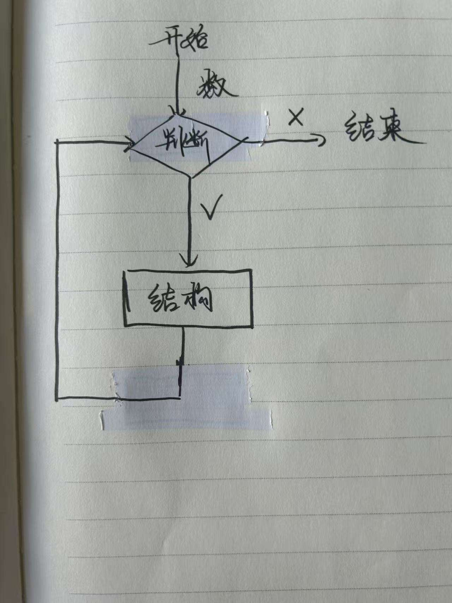
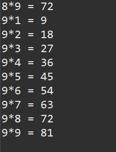
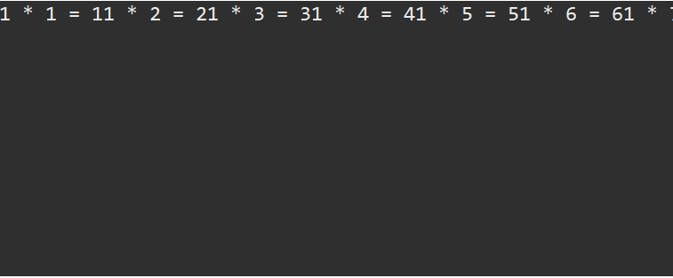
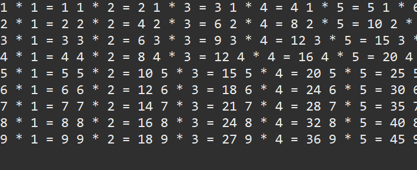
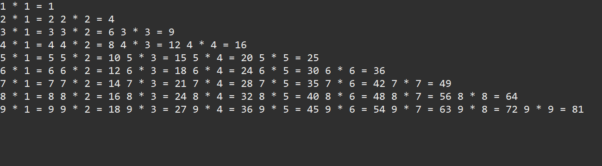

# java学习笔记第三篇：for循环

​上面是导图，首先开始循环，判断一下循环条件，如果是正确的话，进入循环代码，执行代码，然后再次回到循环判断这里，如果还是符合继续执行，重复这个步骤，直到不符合这个循环判断语句，然后呢结束这个循环。
循环就是不停的执行一个逻辑，他经常在重复的代码中使用，比如一段代码需要输出1--100的数字，不能只使用System.out.println();这个结构，不然打100次多没意思，（你这是只有人工，没有智能啊）。所以上面介绍的这个逻辑非常重要。
以上就是循环的主要逻辑。

## 5.2.for循环的结构与例题
### 5.2.1for循环的结构
for循环就是循环结构的主要代码之一
```java
for（循环变量赋初值；循环条件；循环变量增值）{

循环语句；

}
```
这个是for循环的主要结构。

那么我们用这个模板，来写一下之前提到的需要输出1--100的数字这个题目。
```java
public class we {

	public static void main(String[] args) {
		// TODO Auto-generated method stub
		for(int i = 0; i<=100;i++) {
			System.out.println("第" + i + "个数是 " +i);
		}
		
	}

}
```
首先写下for（）这样。
第二步看模板中的第一个：循环变量赋初值 这里写了int i =0（说明了这个初始变量是0），
第三步看模板中的第二个：循环变量赋初值 这里写了 i<=100（如果我的i>100的话，我就不符合我的循环判断了，所以我不能继续循环了）
第四步看模板中的第三个：循环变量增值（或者减值）i++ （指的是i+1）每次循环结束后都要加1，比如说第一个数值是0，那么完成循环代码块的命令后，都需要加1，从而让这个循环继续下去。（如果不加1，那么i一直等于0，这个循环一直存在，这个叫做死循环）
第五步：就是for循环得主要代码块，想让这个代码执行什么操作，都是在这个代码块中写的。

### 5.2.2 for循环例题

例题1：0-100的数字的和
首先分析一下这个题目。
例1：0--100（显然这个是一个循环结构）

```java
public class we {

	public static void main(String[] args) {
		// TODO Auto-generated method stub
		for(int i = 0; i<=100;i++) {
			
		}
		
	}

}
```

这个搭建了循环结构。从0--100，那么题目中说需要知道0--100数字的和。
那么我需要在循环代码块中让这些数字加起来，最后打印出来和值。

```java
public class we {

	public static void main(String[] args) {
		// TODO Auto-generated method stub
		int sum = 0;
		for(int i = 0; i<=100;i++) {
			sum+=i;
		}
		System.out.println(sum);
	}
}
```
这个代码就是答案，首先建立了一个sum容器，这个容器并没有任何液体（所以sum=0）。
那么在这个循环体中
sum+=i（这个代码的含义是sum（原来的）+i=sun（新的））
通过举例子来写。
原来i=0,那么sum（原来=0）+0 = sum（新的还是0）
然后通过i++，i=1，那么sum（原来=0）+1（i从0-->1） = sum（新的是1）（那么在下一次循环中它变成了原来的sum）
i=2，那么sum（原来=1）+ 2（i从1-->2）= sum（新的是3）（下一次中变成了原来的sum）
执行很多次后 i=100 那么sum（原来是=4950） + 100（i从99-->100) = sum（新的是5050，下一次的循环中它变成了原来的sum）
但是i=101后违背了我的判断条件，所以循环结束，结束之后需要执行System.out.println(sum);
那么sum的值是5050，那么5050是通过一次次i的叠加起来的，其实就是0--100的和。


例2：0--100偶数和
这个的循环有点不一样。

```java
public class we {

	public static void main(String[] args) {
		// TODO Auto-generated method stub
		int sum = 0;
		for(int i = 0; i<=100;i+=2) {
			sum+=i;
		}
		System.out.println(sum);
	}
}
```

这里的主要逻辑还是一样的，通过建立一个sum，然后让i不断地增大，然后每次都让sum+i，来完成和的逻辑。（不多阐述）
那么如果来写是一个偶数呢？很简单，再上一个代码中每次i都是+1，那么在这里每次i都加2，（第一个i=0，第二个i+2后i=2，第三个i+2后i=4，…………）那么这个就是偶数的一个和了。
## 5.2for循环的嵌套
和if条件语句的嵌套一样有嵌套语句。
### 5.2.1for循环嵌套语句的结构
for循环不仅可以单独使用，还可以嵌套使用，即在一个for循环的循环体内再包含另一个for循环。这种嵌套结构在处理多维数组、矩阵运算等复杂问题时非常有用。

```java
for (初始化表达式1; 循环条件1; 迭代表达式1) {
    for (初始化表达式2; 循环条件2; 迭代表达式2) {
        // 内层循环体
    }
    // 外层循环体
}
```

这个还是有点抽象
那么还是用例子来写一下。
5.2.2for循环嵌套的例子
例子1：(也是最为出名的）使用嵌套for循环打印乘法表的示例：
首先来回答一下为什么需要使用for循环的嵌套。
首先在99乘法表中，有两个变化量，
​这里有i与j两个数字需要改变 

i × j =number

 （如果i=1的时候j有1--9，并且i不是不变的是可以变化的）所以i，j都能变化，一般的for循环只适合一个数值在变化的情况，并不满足两个在变化的情况，那么一个for循环不可以，使用两个一起就行，所以我们需要使用for循环的嵌套。
```java
​public class we {

	public static void main(String[] args) {
		// TODO Auto-generated method stub
		for(int i = 1;i<=9;i++) {
			for(int j= 1;j<=9;j++) {
				int x = i*j;
				System.out.println(i + "*" + j + " = "+x);
			}
		}
	}
}
```

这个就是第一版的代码。
基础逻辑是，
i=1的时候，j有1--9，9中选择，通过执行内部循环代码块，完成输出。
i=2的时候，同样j有1--9，9中选择，通过执行内部循环代码块，完成输出。
以此类推
i=9的时候，同样j有1--9，9中选择，通过执行内部循环代码块，完成输出。
i=10的时候，显然不符合我i的循环判断，所以外层的不行，内层就进不去，所以循环结束了。
并且这个是这个代码的输出



​（有很长，就不截图了）聪明的我们发现一个问题，这个不是我们熟悉的99乘法表，这个乘法表是竖起来的，不是横着的。那么在这个代码中并不能使用println了（ln代表的是换行）（这个只是一个假设，大胆假设，小心求证）


但是成这样了，更加难看了，显然这个不对，而且两个式子连接的太紧了，实在是不好看
```java
public class we {

	public static void main(String[] args) {
		// TODO Auto-generated method stub
		for(int i = 1;i<=9;i++) {
			for(int j= 1;j<=9;j++) {
				int x = i*j;
				System.out.print(i + " * " + j + " = "+  x + " ");
			}
			 
		}
	}
}
```
然后再x后面加上了一个空格。这个时候打印出来就稍微好看多了，但是我们理想的99乘法表是1*一个数字然后是一行，然后i=2是一行，同样继续下去到i=9是一行。
那么再之前提到我们有外循环代码块与内循环代码块。
刚刚说了这个逻辑通过i=1，然后j=1--9来实现，那么我可以再外循环代码块中加入一个换行的指令，那么等到i变成2的时候我已经换行了。

```java
public class we {

	public static void main(String[] args) {
		// TODO Auto-generated method stub
		for(int i = 1;i<=9;i++) {
			for(int j= 1;j<=9;j++) {
				int x = i*j;
				System.out.print(i + " * " + j + " = "+  x + " ");
			}
			System.out.println() ;
		}
	}
}
```
这个和之前比好多了，出现了9 9乘法表的样子了。


但是到这里，还是不太乐观。
这个确实比之前好看很多了，但是这个不是我们小学学的9 9乘法表啊！这个好像把全部都打印出来了，我们需要的是这样的是1*1=1然后换行。首先我们来看一下乘法表，需要观察并且发现问题，从而改进。
1 * 1 = 1
1 * 2 = 2   2 * 2 = 4
1 * 3 = 3   2 * 3 = 6   3 * 3 = 9 ………………

```java
public class we {

	public static void main(String[] args) {
		// TODO Auto-generated method stub
		for(int i = 1;i<=9;i++) {
			for(int j= 1;j<=i;j++) {//改变了这里，j不能大于i等于i的时候j就停止循环，让外层继续
				int x = i*j;
				System.out.print(i + " * " + j + " = "+  x + " ");
			}
			System.out.println() ;
		}
	}
}
```
最后打印出来的是


​这个就是我们小学学的9 9乘法表。