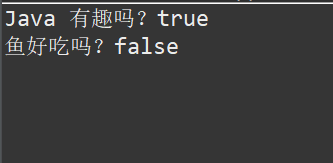
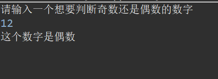
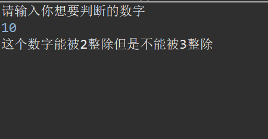
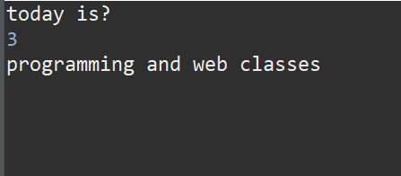
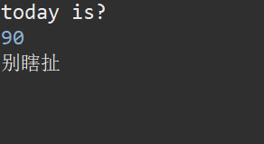
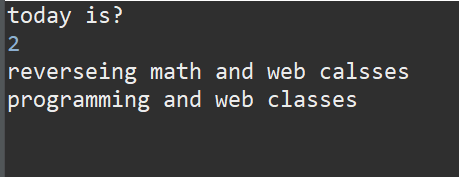

# java学习笔记第二篇：选择结构
## 📌2.1关系表达式（布尔值与逻辑运算符）
### 🎯2.1.1 逻辑运算符

逻辑与：&&
逻辑或：||
逻辑非：！

### 🎯2.1.2 布尔值
布尔值本质也是来判断这个条件是对还是错的。布尔值也是一种变量类型，不过它的回答只有true/flase这两个。有个例子：

```java
public class BooleanExample {
    public static void main(String[] args) {
        boolean isJavaFun = true;   // 定义布尔变量
        boolean isFishTasty = false;

        System.out.println("Java 有趣吗？" + isJavaFun);
        System.out.println("鱼好吃吗？" + isFishTasty);
    }
}
```
boolean如同double，int一样是一种数据类型，这种数据类型是用来判断一个东西是对的还是错的。


那么这个boolen的值是用来判断这句话正确还是错误的
## 📌2.2 if判断语句
判断语句，是用来如果是正确的，会执行一段命令，如果是错误的会执行另外一段命令。
### 🎯2.2.1基本判断语句
我们通过例子来知道判断语句是怎么写的。 主要的格式：
```java
if(num%2==0) {//通过mod来看余数，如果有余数==0的话那么是偶数，因为偶数除以2肯定可以整除			
    System.out.println("this number is even number");
}else {//如果整除不了，那么就是奇数了
	System.out.println("this number is odd number");
}
```

这个是主要if-else判断语句的java命令格式。
其实整个代码的含义是 num%2（num mod 2）是不是等于零 如果是的话 执行 System.out.println("this number is even number");这个代码（打印出来 这个数字是偶数 这个代码）如果不是（进入else语句中）执行System.out.println("this number is odd number"); （打印出来 这个数字是奇数）
if(条件){  条件正确之后，需要做的是啥. }else{ 上面的条件不符合的时候需要做的是啥。 }

让我们来补充完成上面的这个例子
```java
import java.util.Scanner;

public class Price {
    public static void main(String[] args) {
    	Scanner input = new Scanner(System.in);
    	System.out.println("请输入一个想要判断奇数还是偶数的数字 ");
    	int number = input.nextInt();
    	if(number%2==0) {
    		System.out.println("这个数字是偶数");
    	}else {
    		System.out.println("这个数字是奇数");
    	}
        
    }
} 
```


### 🎯2.2.2 判断语句的增强版
如果条件不再是非黑即白了呢？现在的条件成为了三个 或者四个 或者五个 或者更加多的时候呢？
不能在使用if-else结构了 需要增强版的结构了 需要使用if-else if-else结构,通过一个学校里的例子来了解一下

```java
import java.util.Scanner;

public class Price {
    public static void main(String[] args) {
    	Scanner input = new Scanner(System.in);
    	System.out.println("请输入你的成绩");
    	double score = input.nextDouble();
    	if(score>= 90) {
    		System.out.println("你的名次在全年级前15");
    	}else if(score >=80) {
    		System.out.println("你的名次在全年级的15--120");  	
    	}else if(score >=70) {
    		System.out.println("你的名次在全年级的120--400");
    	}else {
    		System.out.println("你的名次在全年级的后400名");
    	}
    	
    }
} 
```
这个是学校里的一个例子，同样也是用了else if（else if在java中可以跟着后面的条件并且可以多次使用）但是else只能使用一次并且不能跟着后面的条件。
而且为什么第一个条件写>=90 ， 第二个条件就不需要写<=90了呢？
很简单程序是从上到下一次看的，比如说你输入的这个score=88，显然不满足第一个条件，那么程序就不会进入这个代码块，直接会看下面的代码，就进入了第二个代码块，首先判断是不是，显然正确，所以进入第二个代码块。所以不需要写。因为是上面不满足其实就代表我的数字一定小于上面的数字，不然就进入代码块了，进入之后就不出来了直接代码就算是结束了。

### 🎯2.2.3 if的嵌套

嵌套是什么含义，是指在if语句中还出现了选择的逻辑关系
举个例子（未满十八岁，不要进入酒吧！！）如果一个人大于18岁并且是身份证能证明的，那么完全没问题可以进入酒吧，如果是相反的呢？那不能进入，如果你有身份证，未满十八不能进入酒吧
```java
import java.util.Scanner;

public class Price {
    public static void main(String[] args) {
    	Scanner input = new Scanner(System.in);
    	System.out.println("请输入你的年纪");
    	int age = input.nextInt();
    	boolean hasID = true;
    	
    	if(age>=18) {
    		if(hasID) {//指的是这个如果boolean的值是true的话可以进入这个代码块，如果boolean的值             //是flase的话，那么就进入else代码块
    			System.out.println("可以进入酒吧");
    		}else {
    			System.out.println("还是要出示一下你的身份证，确认一下");
    		}
    	}else {
    		System.out.println("你没有满18岁，绝对不能进");
    	}   	
    }
} 
```
这个就是嵌套的代码，在第一个if中如果你说你是十八岁，但有两个情况一个是有id一个是没有id两种情况，所以需要进行分类讨论才行。所以产生了if嵌套这个东西。
并且这个例子中使用了boolean数值类型，if(hasID) {//指的是这个如果boolean的值是true的话可以进入这个代码块，如果boolean的值是flase的话，那么就进入else代码块。
第二个例子：什么时候能被2，3整除

```java
import java.util.Scanner;

public class Price {
    public static void main(String[] args) {
    	Scanner input = new Scanner(System.in);
    	System.out.println("请输入你想要判断的数字");
        int number = input.nextInt();
        
        if(number % 2 == 0) {
        	if(number %3 ==0) {
        		System.out.println("这个数字能同时被2，3整除");
        	}else {
        		System.out.println("这个数字能被2整除但是不能被3整除");
        	}
        }else {
        	if(number % 3 == 0) {
        		System.out.println("这个数字能被3整除但是不能被2整除");
        	}else {
        		System.out.println("这个数字不能被2或者3整除");
        	}
        }
    }
}
```
这个前面还是不多说了，是用户交互的段落（可以让用户输入他们想要的代码）。
下面的代码我将使用几个数字进行分析，第一使用12这个数字（能被3，2同时整除）
第一个if(number % 2 == 0)  那么12mod 2 = 0 确实是符合的，那么进入第一个代码块，进入之后判断if(number %3 ==0)条件成不成立，12mod3 =0 当然也成立。所以进入了打印的阶段。
第二个举例子的数字是 15（可以被3整除但是不饿能被2整除）
用户输入这个数字后，进入第一个判断条件 if(number % 2 == 0) 显然15mod2=1，所以不成立 进入下面else那个模块的 进入之后看到条件是 if(number % 3 == 0) 15mod3=0，所以成立 打印出来时真个数字能被3整除到那时不能被2整除。


## 📌2.3 switch判断语句
Switch-case语句，也是一个判断语句，基本的逻辑情况和if-else if-else是差不多的。
通过例子来看看这个判断语句的逻辑与结构 （输入今天是星期几，来看今天有什么课程安排）
```java
import java.util.Scanner;
public class C10 {
	public static void main(String[] args) {
		// TODO Auto-generated method stub
		Scanner input = new Scanner(System.in);
		System.out.println("today is? ");//用户交互界面
		int day = input.nextInt();
		switch(day) {//让下面的所有数字 将和这个day判断
		case 1://day==1的时候，进入这个代码块，以此类推
			System.out.println("math and programming classes");
			break;//必须写break！！
		
		case 2:
			System.out.println("reverseing math and web calsses");
		    break;
		    
		case 3:
			System.out.println("programming and web classes");
			break;
			
		case 4:
			System.out.println("reverseing class");
			break;
			
		case 5:
			 System.out.println("no classes");
			 break;
			 
		case 6:
			System.out.println("no classes");
			break;
			
		case 7:
			System.out.println("no classes");
			break;
		default://如果有乱七八糟的答案（比如说今天是星期90，显然这不符合我们社会的风格）
			System.out.println("别瞎扯");
			break;
		}
	}

}
```



​这个是刚刚代码的运行结果，其实就是day（用户输入之后）switch确定是哪个变量，然后和case后面的数据进行对比，然后符合哪个进入代码块进行输出，如果有乱七八糟的答案，day并没有一样的比如说输入了90 星期90 显然这个风格和我们不太一样 所以使用defalut后面的代码说别瞎扯。



那么为什么不能没有break呢，可以看看如果我的代码少了一个break会怎么样呢？
```java
import java.util.Scanner;
public class Price {
	public static void main(String[] args) {
		// TODO Auto-generated method stub
		Scanner input = new Scanner(System.in);
		System.out.println("today is? ");//用户交互界面
		int day = input.nextInt();
		switch(day) {//让下面的所有数字 将和这个day判断
		case 1://day==1的时候，进入这个代码块，以此类推
			System.out.println("math and programming classes");
			break;//必须写break！！
		
		case 2:
			System.out.println("reverseing math and web calsses");
		   
		    
		case 3:
			System.out.println("programming and web classes");
			break;
			
		case 4:
			System.out.println("reverseing class");
			break;
			
		case 5:
			 System.out.println("no classes");
			 break;
			 
		case 6:
			System.out.println("no classes");
			break;
			
		case 7:
			System.out.println("no classes");
			break;
		default:
			System.out.println("别瞎扯");
			break;
		}
	}

}
```

这个代码是不对的哈，它如果没有break，它会一直往下运行，直到有break出现


结果就是这样。所以写switch-case-default 语句的时候break非常重要，很容易忘记