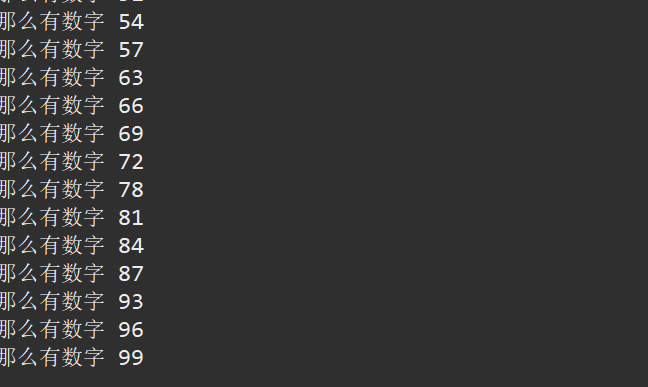

# java学习笔记第四篇：for循环与if条件语句的结合
## 6.1for循环与if条件语句的结合
for循环与if条件语句的配合没有固定的格式。
分析到需要条件语句的话，那么便使用条件语句，如果需要使用for循环便使用for循环，需要实际情况是及分析，实事求是。
那么用例题来分析一下。
### 6.1.1求水仙花数（三位数）
找三位数的水仙花数。
什么叫做水仙花数，比如说153就是水仙花数


（如果是三位数，那么每一位的三次方，然后加起来的综合还是这个数字）那么来写一下这个代码。
其实算法已经清楚了。 个位的三次方+十位的三次方+百位的三次方= 这个数字本身
那么先来看看左边，那么左边是三个数字比如说如果百位是1，十位是1 那么个位有0--9这十个数字的可能，那么这个很想for循环的逻辑来。
那么可以构建for循环的框架了。
```java
public class we {

	public static void main(String[] args) {
		// TODO Auto-generated method stub
		for(int i=1;i<=9;i++) {
			for(int j=0;j<=9;j++) {
				for(int z =0; z<=9;z++) {
					
				}
			}
		}
		
	}
}
```
那么为什么其他两个都是[0,9]而第一个不是，因为第一个是百位，百位不能是0吧，如果百位是0，那不叫三位数，叫二位数。
所以通过这个循环，我可以有任何三位数。
那么，接下来怎么样去写 for循环代码块中的内容呢？
for循环（我把所有的三位数准备好了）那么里面是不是应该把所有的三位数给筛查一下，不是所有的三位数都是水仙花数的，比如说111不是水仙花数吧，所以我们必须要经过筛查一下。那么我来判断这个是不是，需要使用if语句来进行判断与筛查。
那么算法已经有了（个位的三次方+十位的三次方+百位的三次方= 这个数字本身），所以如果这个三位数满足这个，那么我就是水仙花数，打印出来，如果不是的话，那这个数字不是水仙花数。
```java
public class we {

	public static void main(String[] args) {
		// TODO Auto-generated method stub
		for(int i=1;i<=9;i++) {
			for(int j=0;j<=9;j++) {
				for(int z =0; z<=9;z++) {
					if(Math.pow(i, 3)+Math.pow(j, 3)+Math.pow(z, 3) ==)
				}
			}
		}
		
	}
}
```
那么这个后面这个数字怎么表示呢？
很简单百位乘以100加上十位乘以10加上个位乘以1就是这个数字了
然后两者相等就是条件。
```java
public class we {

	public static void main(String[] args) {
		// TODO Auto-generated method stub
		for(int i=1;i<=9;i++) {
			for(int j=0;j<=9;j++) {
				for(int z =0; z<=9;z++) {
					if(Math.pow(i, 3)+Math.pow(j, 3)+Math.pow(z, 3) == i*100+j*10+z*1) {
						int number = i*100+j*10+z*1;
						System.out.println(number);
					}
				}
			}
		}
		
	}
}
```
那么这个能打印出来的就是水仙花数了。

三位数的水仙花数只有这四个，那么for循环与if条件与局的结合就是这个样子，通过分析哪里需要什么来执行。
### 6.1.2喊数字，（1--1000）如果是7的倍数要说这是第几个7的倍数，其他的数字都是喊“哈哈哈哈”
这个也是使用了for循环与if条件语句
首先要喊数字，那么要从1，2，3，4…………那么需要循环下去，这里就要使用到for循环语句，所以基本的结构构建
```java
public class we {

	public static void main(String[] args) {
		// TODO Auto-generated method stub
		
		for(int i =1; i<=1000;i++) {
			
		}

	}
}
```
那么所有的数字都被拿出来了，1--1000，然后呢再for循环的代码块里，需要判断是不是7的倍数，需要使用条件语句，如果是7的倍数，那么要说这个是第几个七的倍数，那么如果不是的话，要说哈哈哈哈。
那么基本的框架可以搭好了
```java
public class we {

	public static void main(String[] args) {
		// TODO Auto-generated method stub
		for(int i =1; i<=1000;i++) {
			if(i%7==0) {
				
			}else {
				System.out.println("哈哈哈哈");
			}
			
		}

	}
}
```

这里有一个问题，如果是七的倍数，那么我们怎么知道这是第几个呢？条件语句只能帮助我判断数字是不是7的倍数，而不能判断这个数字是第几个7的倍数。
在这里可以像之前的sum的题目一样（https://github.com/CharlesWesley-S/computer-science-notes/blob/main/%E4%B8%AD%E6%96%87/%E5%9F%BA%E7%A1%80%E7%BC%96%E7%A8%8B/java/java%E5%AD%A6%E4%B9%A0%E7%AC%94%E8%AE%B0%E7%AC%AC%E4%B8%89%E7%AF%87%EF%BC%9Afor%E5%BE%AA%E7%8E%AF.md)
中一样先创造一个变量（这个变量作为计数器使用）。
当i=7的时候，里面的条件语句是成立的，那么进入条件语句，我的计数器可以加一，所以最后输出是第一个7的倍数，以此类推。

```java
public class we {

	public static void main(String[] args) {
		// TODO Auto-generated method stub
		int n = 0;
		for(int i =1; i<=1000;i++) {
			if(i%7==0) {
				n++;
				System.out.println("这个是第 " + n + "个7的倍数 ");
			}else {
				System.out.println("哈哈哈哈");
			}
			
		}

	}
}
```
这个就是题目的代码。
### 6.1.3输出 1～100 中能被 3 整除但不能被 5 整除的数
那么还是先读题，输出1--100，到这里就是for循环结构，因为for循环可以把1--100这么多的数字准备好。

```java
public class we {

	public static void main(String[] args) {
		// TODO Auto-generated method stub
		for(int i =1;i<=100;i++) {
			
		}

	}
}

```
这个就是for循环的结构，那么后面继续看题目，能被3整除但是不能被5整数的数字。
那么这里需要if条件语句了，而且有两个条件一个是能被三整除，一个是不能被5整除的，那么是一个if嵌套（或者使用逻辑运算符 &&，​这个在
https://github.com/CharlesWesley-S/computer-science-notes/blob/main/%E4%B8%AD%E6%96%87/%E5%9F%BA%E7%A1%80%E7%BC%96%E7%A8%8B/java/java%E5%AD%A6%E4%B9%A0%E7%AC%94%E8%AE%B0%E7%AC%AC%E4%BA%8C%E7%AF%87%EF%BC%9A%E9%80%89%E6%8B%A9%E7%BB%93%E6%9E%84.md
中也是提到了）
```java
public class we {

	public static void main(String[] args) {
		// TODO Auto-generated method stub
		for(int i =1;i<=100;i++) {
			if(i%3==0) {
				if(i%5!=0) {
					
				}
			}
		}

	}
}
```
```java
public class we {

	public static void main(String[] args) {
		// TODO Auto-generated method stub
		for(int i =1;i<=100;i++) {
			if(i%3==0) {
				if(i%5!=0) {
					
				}
			}
		}

	}
}
```
最后的代码是这样的，然后输出呢是

这个上面是使用嵌套的，那么使用&&（和的意思）这个是怎么样的呢
```java
public class we {

	public static void main(String[] args) {
		// TODO Auto-generated method stub
		for(int i =1;i<=100;i++) {
			if(i%3==0 && i%5!=0) {
				System.out.println("那么有数字 " + i);
			}
		}

	}
}
```
if条件语句这个含义是 必须要满足能够整除3和整除5才能判断正确。
结果输出是一样的。