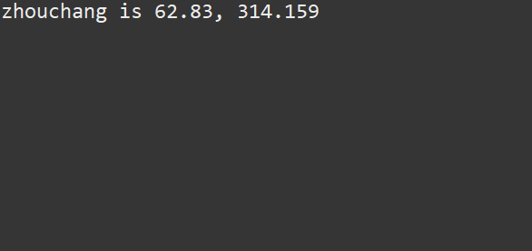
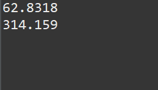
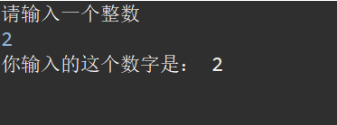
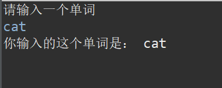
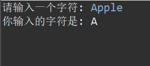
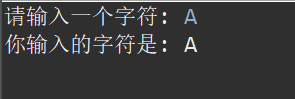

# java:1基本知识

## 1. 变量
想象计算机的内存是一家旅馆，旅馆里有很多房间，每个房间都有一个编号（类似于变量的地址），并且每个房间只能住特定类型的客人（类似于变量的数据类型）
变量名 = 房间号 （101，202，201，302…………）
变量类型 = 房间的类型（单人间，双人间，情侣套房，豪华总统套房……）
变量的值 = 住客（住客必须符合房间的类型，比如说五个人不能睡一个人的房间，比如说情侣睡普通的双人间那可以，但是有情侣套房肯定更喜欢一点等等）
```java
public class PRICE {
	public static void main(String[] args) {
		// TODO Auto-generated method stub
		int price = 15;
		int num = 20;
		int allprice = price * num;
		System.out.println("total price is " + allprice);
	}
}
```
在这里不需要理解这个代码的含义，price是一个变量，可以理解成是一个房间号，并且房间的类型（是int）然后住客是15，同样num也是一个变量，类型也是int，住客（数值）是20，allprice也是一个变量，不过它的数值需要使用price乘num得到的。
```java
public class Price {

	public static void main(String[] args) {
		// TODO Auto-generated method stub
		double price = 10.0;
		int number = 30;
		double total = price * number;
		System.out.println("最后的总价是  "+ total );
	}
}
```
这个地方有 三个变量，price的变量类型是double 数值是10.0，然后呢 这个number的变量 类型是int 数值是 30，还有一个变量total 类型是 double 需要使用price *number进行的。

## 1.1. 输出

那么还有一句话System.out.println（）这个System（系统） out（输出） print（打印） 其实本质上就是系统输出打印的意思，简单来说就是输出的含义。而这个ln是换行的含义 打印下一个在下一行
所以在java中我们通常使用 System.out.println（）来输出。
```java
System.out.printf("zhouchang is %.2f, ", zhouchang);
```
这句话与刚刚的不一样，在最后使用了 `printf`（print：打印；f:format：格式）代表最后打印出来要按照一定的格式，而格式可以我们来定，那么`zhouchang is %.2f, `这句话就是我的格式 我输出是按照这个方式输出的，那么` %.2f`是什么意思呢? 指的是这个地方的数据输出的话必须是一个2位小数。 后面跟着的zhouchang就是传入到%.2f 然后使用两位小数输出。

```java
public class Price {

	public static void main(String[] args) {
		// TODO Auto-generated method stub
		final double PI = 3.14159;
		int r = 10;
		double zhouzhang = 2*PI*r;
		double square = PI *r*r;
		System.out.printf("zhouchang is %.2f, ", zhouzhang);
		System.out.println(square);
		
	}

}
```
输出就是



因为第一句话打印 没有使用 println 所以第二个并没有换行 所以成为这个样子。

## 1.2. 变量名称
那么 我们一个一个来解释，那么第一变量名称有什么特殊的要求。
1. ​字母、数字和下划线：变量名可以由字母（A-Z，a-z）、数字（0-9）和下划线（_）组成，但必须以字母或下划线开头。例如，age、_count、userName1都是合法的变量名，而1user、@name则是非法的。
2. ​区分大小写：Java是区分大小写的，因此age和Age是两个不同的变量名。
3. ​不能使用关键字：变量名不能使用Java的关键字（如int、class、public等），因为这些关键字有特殊的含义。
4. ​命名规范：为了提高代码的可读性，通常采用驼峰命名法​（camelCase），即变量名中的第一个单词小写，后续单词的首字母大写。例如，firstName、totalAmount、totalStudentNumber。

## 1.3. 变量类型
那么在1中经常说的变量类型(之前说的房间类型) int，double这些，在这里会写到。

int：整数
double：浮点数（小数）
String：字符串
char：一个字母（比如说'A')
final：常量（后面的变量名称所有字母全部大写）然后不能更改，如果更改就会报错（不是一个变量类型，后面需要跟着其他的一个）

```java
public class practice2 {
	public static void main(String[] args) {
		// TODO Auto-generated method stub
		int r = 10;
		final double PI = 3.14;//后面的变量名称大写并且不能修改
		double zhouchang = 2* PI * r;
		double mianji = PI * r*r;
		System.out.println(zhouchang);
		System.out.println(mianji);
	}
}

```
int 是整数所以我后面的数值只能入住整数的人；然后final不是一个变量类型。需要后面加入一个double这一个数据类型。后面因为PI都是double类型的，所以zhouchang这个数据类型（两个整数乘一个小数）那么肯定是一个小数，所以要使用double这个数据类型。
```java
public class Price {

	public static void main(String[] args) {
		// TODO Auto-generated method stub
		final double PI = 3.14159;
		int r = 10;
		double zhouzhang = 2*PI*r;
		double square = PI *r*r;
		System.out.println(zhouzhang);
		System.out.println(square);
		
	}

}
```


这个就是上面这个代码的输出。
## 1.4算术运算符
### 1.4.1 一般的算术运算符

加：+
减：-
乘：*
除：/,这个除法呢除完之后取值，不管后面有什么
mod：%，这个是取余数的运算

### 1.4.2特殊的算术运算符（++，--）

```java
public class c3 {
	public static void main(String[] args) {
		// TODO Auto-generated method stub
		int num =2;
		System.out.println(num++);//这个答案是2 因为先取出后运算 在后面++
		int num = 5;
        int result1 = num++;  // 后置自增：先赋值，后 num 变成 6
        int result2 = ++num;  // 前置自增：num 先变成 7，然后赋值
        System.out.println("result1 = " + result1); // 输出 5
        System.out.println("result2 = " + result2); // 输出 7
        System.out.println("num = " + num);         // 输出 7
		int num1 =2;
		System.out.println(++num1);//这个答案是3，因为先运算后取出。有一个顺序上的问题
		int num2 =2;
		System.out.println(--num2);//这个答案是1，因为先运算后取出，以此类推，num--（如果num是2的话）那么答案应该是1
	}
}
```
num++ 指的是后置自增（指的是 result1先成为5（4+1）然后num成为6）所以打印出来是5

++num指的是前置自增（指的是num先变成7（6+1）然后result2成为7）所以打印出来是7
如果是num2=2；然后最后打印出来使用--num2

--num2 那么前置自减（先把num2 变成1（2-1）然后输出1）
减与加都是一样的。

## 2. Scanner
Scanner就是接受用户输入，在一般的系统中，我们通常使用的app中，我们如果想要登录这个app的话，需要的就是输入你的用户名与密码。但是我们学到现在还不能实现自己输入这个情况，那么与我们现实生活中其实是相悖的，所以我们需要做的其实就是使用一个方法，然后实现这个目标。
## 2.1int类型
这个就是可以输入自己想要的东西:
`Scanner input = new Scanner(System.in);（这个就是系统输入，对应的是系统输出）`
`int num = input.nextInt();（对于int来说）`
而这个Scanner是前人总结的经验之谈，所以我们需要引用一个包 import java.util.Scanner; 使用这个之后就能输入值了.

```java
import java.util.Scanner;
public class Price {

	public static void main(String[] args) {
		// TODO Auto-generated method stub
		Scanner input =  new Scanner(System.in);
		int number = input.nextInt();
		System.out.println("你输入的这个数字是： " + number);
	}

}
```
如果是这样子输入的话会导致 什么都没有（因为没有任何的提示你要输入什么东西）虽然你输入一个数字 这个代码没有任何问题，但是对于用户来说你这个简直是天书，完全不知道要输入什么写一段代码需要考虑到用户好不好用，这个叫做用户交互，所以改成这样最好。

```java
​import java.util.Scanner;
public class Price {

	public static void main(String[] args) {
		// TODO Auto-generated method stub
		Scanner input =  new Scanner(System.in);
		System.out.println("请输入一个整数 ");
		int number = input.nextInt();
		System.out.println("你输入的这个数字是： " + number);
	}

}
```
这样子的输出是这样的


这个才是体谅用户的，你告诉用户要干什么，用户才能输入一个数字。
## 2.2 double类型
如果并不是一个整数呢，而是一个小数那么应该这样写

```java
import java.util.Scanner; // 引入 Scanner

public class Main {
    public static void main(String[] args) {
        Scanner input = new Scanner(System.in); // 创建 Scanner 对象
        
        System.out.print("请输入一个 double 类型的数字: ");
        double num = input.nextDouble(); // 读取用户输入的 double
        
        System.out.println("你输入的数字是: " + num);
        
        input.close(); // 关闭 Scanner
    }
}
```
在这里有两个不一样的点 第一：`double num = input.nextDouble(); // 读取用户输入的 double 改成nextDouble就行。` 第二：在最后有一句话 `input.close();` // 关闭 Scanner 这个是为了安全性的，每次输入完 最好使用这句话关闭Scanner 

输入的是double的类型，所以代码不再是i`nt num = input.nextInt();而是double num = input.nextDouble();`。 同样还有char String两种数据类型如果要输入这两个的话需要不同的命令

## 2.3 String类型
String类型可以是两个
第一个类型
```java
import java.util.Scanner;
public class Price {

	public static void main(String[] args) {
		// TODO Auto-generated method stub
		Scanner input =  new Scanner(System.in);
		System.out.println("请输入一个单词 ");
		
		String word = input.next();
		System.out.println("你输入的这个单词是： " + word);
	}

}
```

这个类型使用了nextLine（）读取了整行字符串。‘
第二个类型
```java
import java.util.Scanner;
public class Price {

	public static void main(String[] args) {
		// TODO Auto-generated method stub
		Scanner input =  new Scanner(System.in);
		System.out.println("请输入一个单词 ");
		
		String word = input.next();
		System.out.println("你输入的这个单词是： " + word);
	}

}
```
这个类型直接使用next（） 就可以 输出都是一样的


## 2.4 char类型

char类型的输入比较复杂 
```java
//对于char来说
import java.util.Scanner;  // 导入 Scanner 类

public class CharInput {
    public static void main(String[] args) {
        Scanner scanner = new Scanner(System.in);  // 创建 Scanner 对象
        
        System.out.print("请输入一个字符: ");
        char inputChar = scanner.next().charAt(0);  // 读取用户输入的第一个字符
        
        System.out.println("你输入的字符是: " + inputChar);
        
        scanner.close();  // 关闭 Scanner，防止资源泄漏
    }
} 
```
`char inputChar = scanner.next().charAt(0);  // 读取用户输入的第一个字符 `

输出是这样的


当然如果你输入的是一个字母 也是可以的


