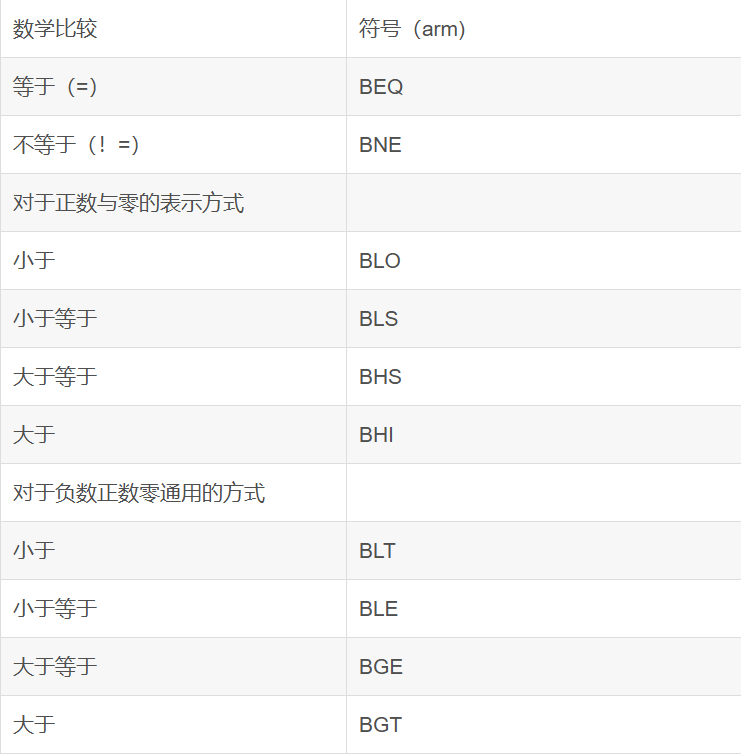

# arm汇编语言3：伪代码与if语句
## 3.1伪代码（pseudocode）
伪代码，名字叫伪么，代表的就是假的代码，代码是假的，是用介于自然语言和计算机语言之间的文字，符号之类的东西，它的作用很简单，因为它是使用了代码与算法的逻辑，然后又结构较为简单，清楚。所以可以帮助我们一下在理解这段代码的逻辑。

所以有些时候在面对很难的代码的时候，我们会选择先写一下伪代码，然后通过伪代码写代码。

## 3.2if语句的arm表示
if语句在python，java等等高级语言中都非常常见，所以说这个非常的重要。

我们可以先来看一下高级代码是咋写的（这里使用Java写一下）
```java
import java.util.Scanner;
public class ifelse {

	public static void main(String[] args) {
		Scanner input = new Scanner(System.in);
		System.out.println(" 你想输入的数字");
		int a = input.nextInt();
		if (a<=1000) {
			a--;
			System.out.println(a);

	    }else {
	    	a++;
	    	System.out.println(a);


	     }
    }
}
```
首先我们得知道这一段代码在讲啥，这段代码其是非常简单，讲的就是，当你写一个数字然后if会进行判断，小于等于1000的话，那个数字就会减一，反之数字会进行加一。

理解完这个代码之后，我们下一步就准备开始写arm语言的东西，首先我们需要比较两个数字的大小，但是我们现在并没有办法去比较两个数字的值，在这里我们有一个命令叫做CMP

CMP的命令就是使两个数值进行比较

```arm
CMP R1,#1000
```
这个就是在比较（这里我默认了R1就是我所输入的数字，等会儿可以直接mov一个进去）

那么怎么比较呢？这个当机器看的时候，它是怎么判断是大于等于还是不等于还是小于呢，这时候我们会在接下来的一行中
```arm
CMP R1,#1000
BGT ELSE
```

这里的BGT是跳转命令，然后呢 和它一样的还有

这里会有一张表格


而BGT后面的是标签，如果R1大于1000之后，代码跳转到BGT后面的标签上当然我现在还没有展示出来。所以这一句话就是，R1与1000作比较，然后大于的话会跳转到这个代码的地方，但是没有跳转的话继续这个代码。那这个意思不就是<=的意思么，我大于跳转，小于等于的话不用跳转，运行下面的代码。

```arm
 CMP R1,#1000
 BGT ELSE
 SUB R1,R1,#1
ELSE:
 ADD R1,R1,#1

```
这个代码的是接着之前的代码的，含义也是当我的R1比1000要小于等于的话，那么我的R1是要在减一的，但是当我的R1是比1000要大的，我们跳转到ELSE这个标签（这个标签啥作用都没有，就是像word文档里面的超链接，而超链接 就是一下子跳到这个地方。）

这个代码还需要输入一个值
```arm
 MOV R1,#293
 CMP R1,#1000
 BGT ELSE
 SUB R1,R1,#1
ELSE:
 ADD R1,R1,#1
```

那么你们大家觉着，到现在来说代码就正确了吗？其实并不是这样的，代码到现在还不正确，这个代码还有一个非常明显的错误，这个代码完成了我们期望的到了SUB。到那时它会停止么？并不会，它会继续往下看，然后把这个我们所期望的数字先减1然后再加1.所以会发生错误。

因为这个汇编语言并不像高级语言中的ifelse一样这个不满足直接跳走。所以在最后应该还需要加上一句话。
```arm
 MOV R1,#293
 CMP R1,#1000
 BGT ELSE
 SUB R1,R1,#1
 B   End_Main
ELSE:
 ADD R1,R1,#1
End_Main:
  BX LR @ 这个命令是让程序停止的意思

 ```

 这个最后一句话 B 代表无条件跳转，可以直接跳转到后面标签这里。

这个就是一般的if在arm的表示。但是发生了这样的情况的话，这个arm代码需要更加灵活一点。

```java
import java.util.Scanner;
public class ifelse {

	public static void main(String[] args) {
		Scanner input = new Scanner(System.in);
		System.out.println(" 你想输入的数字");
		int a = input.nextInt();
		if (a<=1000 && a>10) {
			a--;
			System.out.println(a);

	    }else {
	    	a++;
	    	System.out.println(a);


	     }
    }
}
```
我就改了一点点，添加了一点逻辑运算符（和）那么arm代码应该怎么表示
```arm
 MOV R1,#293
 CMP R1,#1000
 BGT ELSE
 CMP R1,#10
 BLE ELSE
 SUB R1,R1,#1
 B   End_Main
ELSE:
 ADD R1,R1,#1

End_Main:
  BX LR @ 这个命令是让程序停止的意思
 ```

- 第一个CMP：如果R1 > 1000，直接跳到ELSE
- 第二个CMP：如果R1 ≤ 10，也跳到ELSE
- 只有两个条件都不满足（R1 ≤ 1000 且 R1 > 10），才执行SUB

