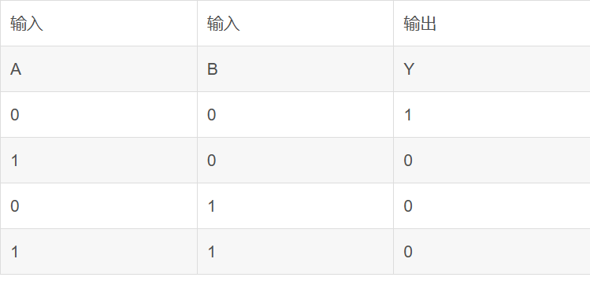

# 硬件1：逻辑门

逻辑门是计算机中的基础，是用来实现编程中if，while等等，是计算机的重要组成部分。

## 1.1 逻辑门（logical gate）（只有单一输入的逻辑门）
### 1.1.1YES gate（是门）
是门的含义是yes，表达肯定的含义，所以输入1，输出就是1，输入是0，输出就是0。

​​
​​​​

这个1与0能可以想象成一个高电压一个低电压的形式，1为高电压而0为低电压。

输入一个高电压输出一个高电压，而输入一个低电压，输出一个低电压。同样输入一个低电压，输出一个低电压。

### 1.1.2 NOT gate (非门）
第二个逻辑门的话就是非门，在这里可以观察到非门与是门的不同处就是有一个珠子，这个代表相反的意思。只要有这个珠子，功能就是相反。

非门的含义也很清楚，我需要全部取反。

但是这里有一个反常识的点，我低电压进去为啥是高电压出来呢？这里面一定有什么东西，这个是晶体管的功能，通过晶体管电路可以做到。

## 2.2双输入逻辑门（2 input logical gate)
在这个双输入逻辑门中首先来介绍一下与门
### 2.2.1 and gate(与门)

在这里就有两个输入的渠道了，同样先来看一下真值表。注意在这个图中左边是输入的部分，然后标为输入A与输入B，然后输出使用Y 表示。

与是什么意思，A这个条件和B这个条件需要一起满足，输出才能是高电平的，不然无法输出，这个就是if语句中 实现and 条件的逻辑门。
### 2.2.2OR gate（或门）
或是什么意思，或的意思是或者，A这个条件B这个条件，满足一个就行，A或者B满足就行，但是不能什么都不满足，所以真值表是

在这个真值表中，只要有一个输入的是高电位，那么输出的一定是高电位。
### 2.2.3XOR gate（异或门）
异或，这个词语在生活中并不常见，和，或还是非常常见的，异或指的是如果两个输入的一样输出的便是1，如果两个输入一样那么就是0，这个异或门在后面的全加器非常重要。

输入与输出的关系是这样的。

这些逻辑门是通过一些逻辑门组合而成，因为有些逻辑门使用的多从而进行整理总结。
### 2.2.4 NAND （与非门）

与非门这个名字就能知道是与门与非门之间的结合，（not gate与and gate的结合）前面有一个珠子，所以只要记住and gate就行，这个门就是反一下就行

首先它的真值表是

这个结果与and gate（与门）完全相反，所以我们通过这个思路来画一下这个与非门的
同理

### 2.4.5 NOR（或非门）
或非门与与非门是一个含义，或非门的真值表是与或门完全相反的。所以结构与上面那个是一样的无非是一个and gate换成了or gate这样的情况。同样前面有一个珠子，本质上只要记住正的，反着的输出换一下就行。

这个就是或非门的图像，真值表是

与与门的完全相反，所以或非门与上面的结构应该是一样的，或非门就是使用了一个或门与非门的结合体

这个就是XNOR gate本质上是异或门反着来，了解了异或门，其实反着就行。

