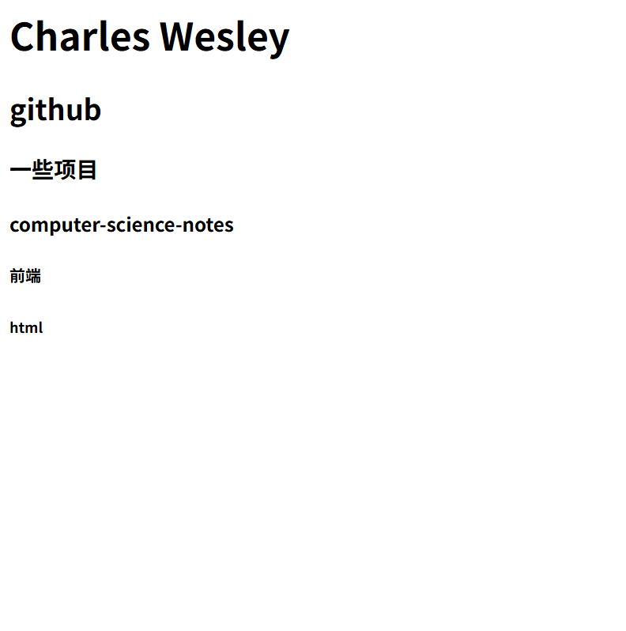
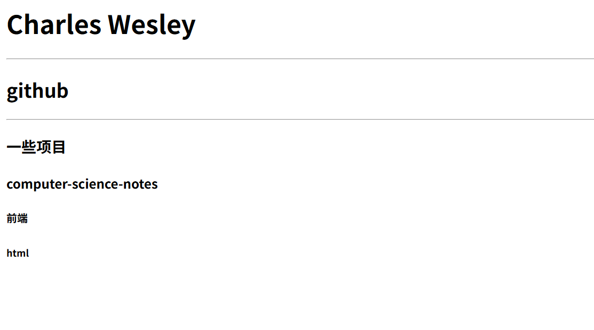
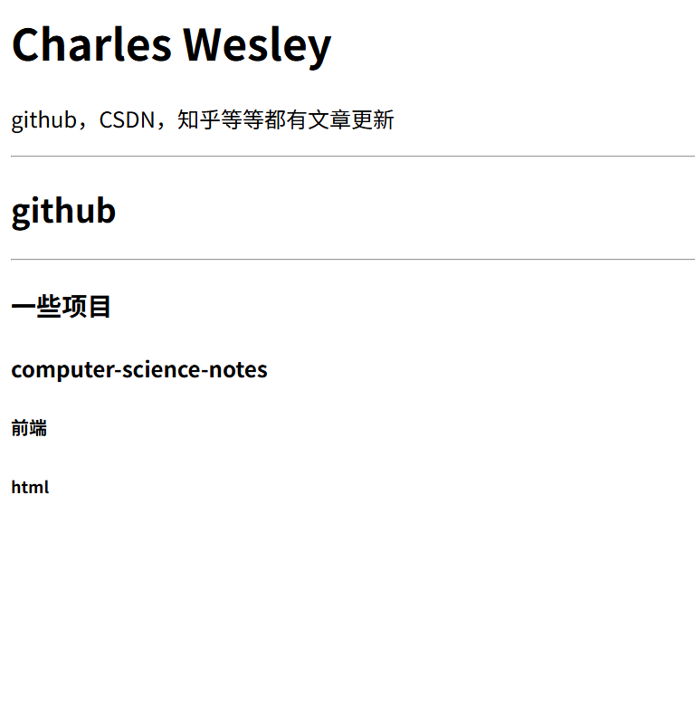
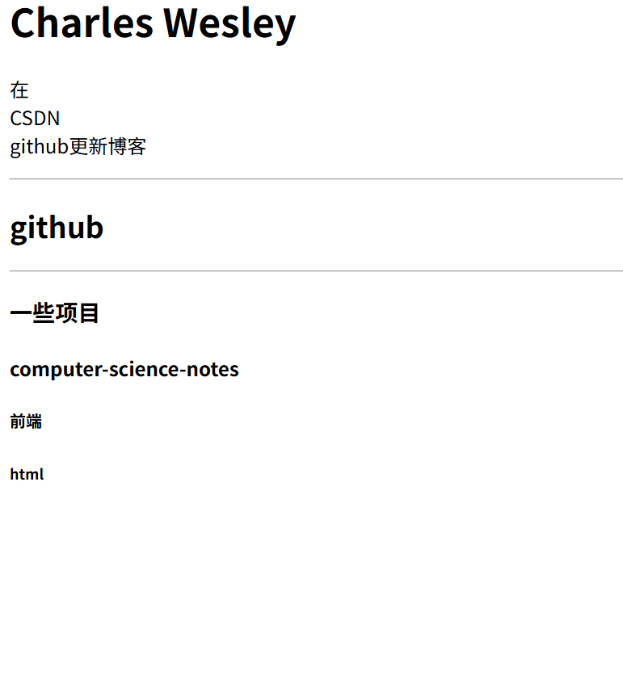

# html1: 从html开始了解网页

## 1.1html的介绍
HTML是一种标记语言，用于创建，设计网页及其内容。它通过标记和标签定义网页中的结构和元素，如标题、段落、链接、图像等。HTML 文件通常以 `.html` 扩展名保存，并通过浏览器进行渲染，展示给用户，即我们现在所看到的网页。在html中会出现很多类似于 `<h1> `这样的东西，我们称它为标签，html中需要注意的是，标签往往是成双成对的出现。比如说 `<h1> `    ` </h1>`

## 1.2html的基础1
### 1.2.1标题，头部与基本的格式怎么写
#### 1.2.1.1标题与基本格式
标题的英文是head,所以它的标签是`<h>`,而`<h1>--<h6>`便是标题的等级，`<h1>`便是最大的那个标题，而`<h6>`就是最小的标题。但是在写代码的时候，与之前我更新的python文档中还是很不一样的。看一下一个例子

这里的话需要注意，html的运行方式与python，java，C很不一样，因为python，java，C属于后端，html属于前端，前端就是指你可以看到的网页。所以说vscode无法像浏览器一样解析这一段代码，所以运行与python很不一样。运行的步骤第一步：保存你的代码，第二步：找到这个编程所对应的文件，第三步：用浏览器打开。
```html
<html>

    <body>
        <h1>Charles Wesley</h1>
        <h2>github</h2>
        <h3>一些项目</h3>
        <h4>computer-science-notes</h4>
        <h5>前端</h5>
        <h6>html</h6>
        
    </body>

</html>
```
这里首先需要写`<html>`，这个表示这段代码表示的是html的语言，注意不要忘记`</html>` （但是这个vscode中会自动显示）
这里h1，h2等等都需要成双成对的出现。



这个就是标题的大小的分布。

在上面看到的html基本上都是成双成对的出现，在html中大部分都是成双成对的出现，但是也有另类，比如说下面的`<hr>`，是增加分割线的
```html
<html>
    <body>
        <h1>Charles Wesley</h1>
        <hr>
        <h2>github</h2>
        <hr>
        <h3>一些项目</h3>
        <h4>computer-science-notes</h4>
        <h5>前端</h5>
        <h6>html</h6>
        
    </body>

</html>
```


#### 1.2.1.2头部
头部指的是标签页上打开的名称，像是下面的 ，在网页中如何实现呢，使用`<title></title>`这就是头部的意思，并且需要成双成对的出现。
```html
<html>
    <head>
        <title>Charles Wesley</title>
    </head>

    <body>
        <h1>Charles Wesley</h1>
        <hr>
        <h2>github</h2>
        <hr>
        <h3>一些项目</h3>
        <h4>computer-science-notes</h4>
        <h5>前端</h5>
        <h6>html</h6>
        
    </body>

</html>
```
这里的头部已经改成了Charles Wesley。

### 1.2.2段落
段落的英文是paragraph，所以说在html的标签是<p>，注意不要忘记它的“兄弟”</p>（需要双向）
```html
<html>
    <body>
        <h1>Charles Wesley</h1>
        <p>github，CSDN，知乎等等都有文章更新</p>
        <hr>
        <h2>github</h2>
        <hr>
        <h3>一些项目</h3>
        <h4>computer-science-notes</h4>
        <h5>前端</h5>
        <h6>html</h6>
        
    </body>

</html>
```


在大标题下面就添加了一行关于我的介绍。

如果在写段落的时候，想要换行，不希望把段落的每一行写得很长，也不好看，我么可以使用`<br>`来进行分段，它和`<hr>`一样比较另类，没有“兄弟”，单独出现。
```html
<html>
    <head>
        <title>Charles Wesley</title>
    </head>

    <body>
        <title>Charles Wesley</title>
        <h1>Charles Wesley</h1>
        <p>在<br>CSDN<br>github更新博客</p>
        <hr>
        <h2>github</h2>
        <hr>
        <h3>一些项目</h3>
        <h4>computer-science-notes</h4>
        <h5>前端</h5>
        <h6>html</h6>
        
    </body>

</html>
```
 CSDN与github换行了，这就是`<br>`的作用。


