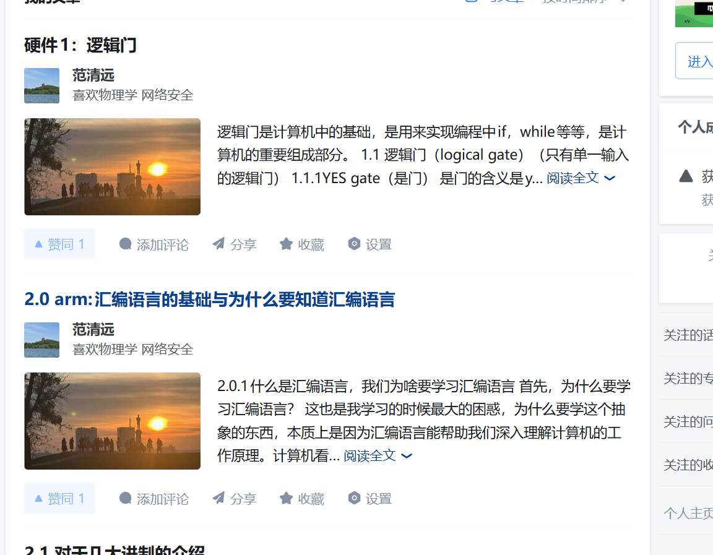
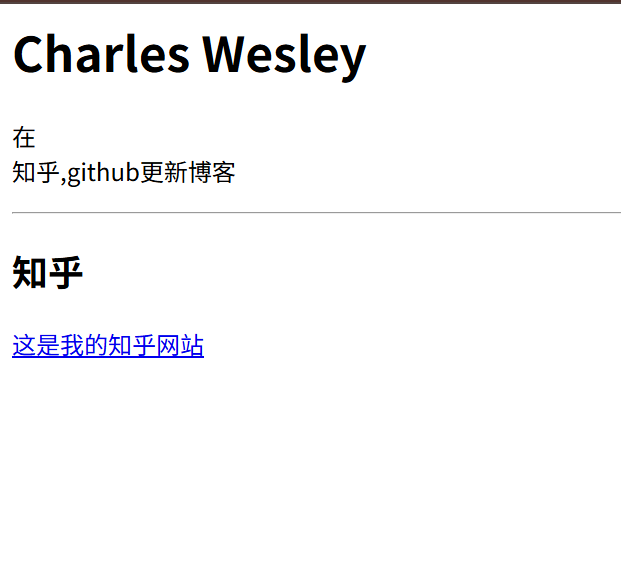
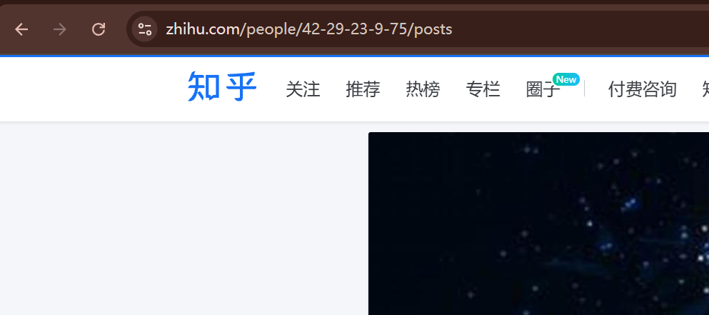
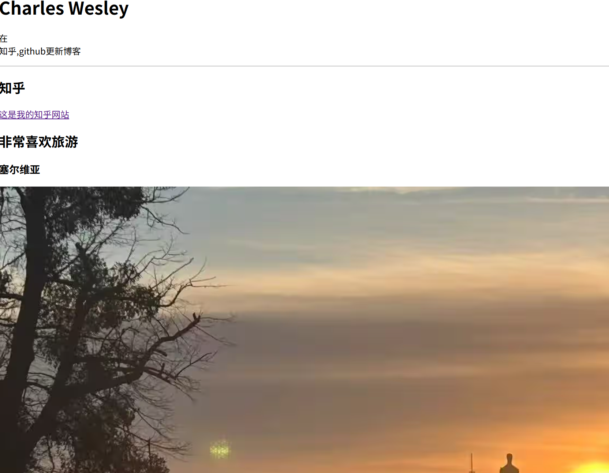
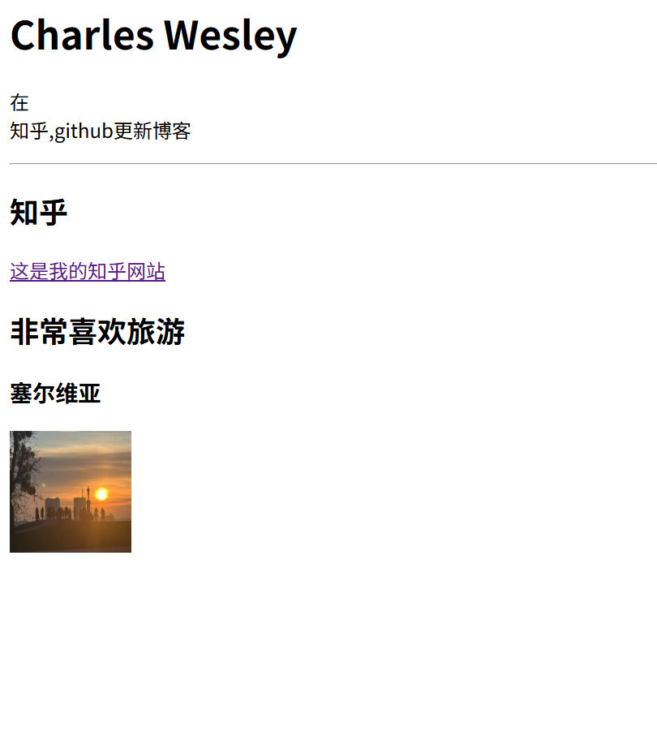
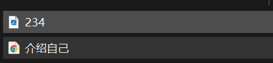
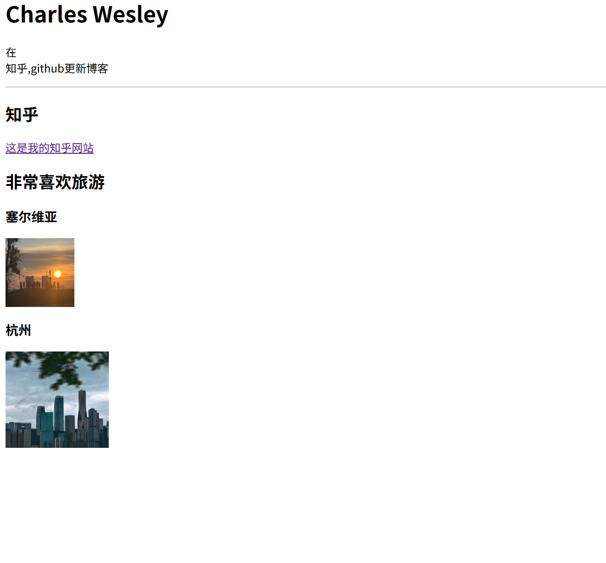

# html2：超链接与图片

## 2.1 html的超链接


在知乎的网页中，点击标题，就会跳转到文章（也就是不同网页），本质上html的代码是超链接

```html
<a href="https://www.zhihu.com/people/42-29-23-9-75/posts">这是我的知乎网站</a>
```

这个就是html中超链接的使用方式，在`<a href="https://www.zhihu.com/people/42-29-23-9-75/posts">`这是把想要跳转的网页嵌入，在后面`这是我的知乎网站</a>`这是在网页显示的文字，点击这个文字就能到其他地方了。

```html
<html>
    <head>
        <title>Charles Wesley</title>
    </head>

    <body>
        <title>Charles Wesley</title>
        <h1>Charles Wesley</h1>
        <p>在<br>知乎,github更新博客</p>
        <hr>
        <h2>知乎</h2>
        <a href="https://www.zhihu.com/people/42-29-23-9-75/posts">这是我的知乎网站</a>
        
    </body>

</html>
```


在这个网页中，就有链接的蓝色了，点击链接就可以跳转了。

### 2.1.1 target性质
在上面，如果点击链接，在同一个页面跳转， 跳转在同一个页面上，如果想要跳转在不同的页面，想要同时看两个页面的话，需要加入`target`标签
```html
<html>
    <head>
        <title>Charles Wesley</title>
    </head>

    <body>
        <title>Charles Wesley</title>
        <h1>Charles Wesley</h1>
        <p>在<br>知乎,github更新博客</p>
        <hr>
        <h2>知乎</h2>
        <a href="https://www.zhihu.com/people/42-29-23-9-75/posts" target = "_blank">这是我的知乎网站</a>
        
    </body>

</html>
```
这里`target ="_blank" `中指的是再开一个网页的意思。


## 2.2 图片
在一个网页中图片是不可缺少的，也是非常重要的元素，那么制作网页的过程中如何嵌入照片呢
```html

```
这是html中使用照片的定义


```html

```

```html
<html>
    <head>
        <title>Charles Wesley</title>
    </head>

    <body>
        <title>Charles Wesley</title>
        <h1>Charles Wesley</h1>
        <p>在<br>知乎,github更新博客</p>
        <hr>
        <h2>知乎</h2>
        <a href="https://www.zhihu.com/people/42-29-23-9-75/posts" target = "_blank">这是我的知乎网站</a>
        <h2>非常喜欢旅游</h2>
        <h3>塞尔维亚</h3>
        
        
    </body>

</html>
```

这个照片实在是太大了，所以说需要定义一下高与宽。

```html
<html>
    <head>
        <title>Charles Wesley</title>
    </head>

    <body>
        <title>Charles Wesley</title>
        <h1>Charles Wesley</h1>
        <p>在<br>知乎,github更新博客</p>
        <hr>
        <h2>知乎</h2>
        <a href="https://www.zhihu.com/people/42-29-23-9-75/posts" target = "_blank">这是我的知乎网站</a>
        <h2>非常喜欢旅游</h2>
        <h3>塞尔维亚</h3>
        
        
        
    </body>

</html>

```

这就是调整之后照片的大小，同样可以调整width，height里面的参数，从而放大与缩小图片

在一个html代码中，照片是需要加载时间的，所以如果照片过多会需要一点时间加载出来。

不仅仅需要链接才能做到，一个照片如果在同一个文件夹中（在你本地的电脑，同一个文件夹中）可以使用文件命来调用图片。

我把叫做234.jpg的照片放到了一个文件夹里
```html
<html>
    <head>
        <title>Charles Wesley</title>
    </head>

    <body>
        <title>Charles Wesley</title>
        <h1>Charles Wesley</h1>
        <p>在<br>知乎,github更新博客</p>
        <hr>
        <h2>知乎</h2>
        <a href="https://www.zhihu.com/people/42-29-23-9-75/posts" target = "_blank">这是我的知乎网站</a>
        <h2>非常喜欢旅游</h2>
        <h3>塞尔维亚</h3>
        
        <h3>杭州</h3>
        
    </body>

</html>
```
打开网站就多了234.jpg的照片。



